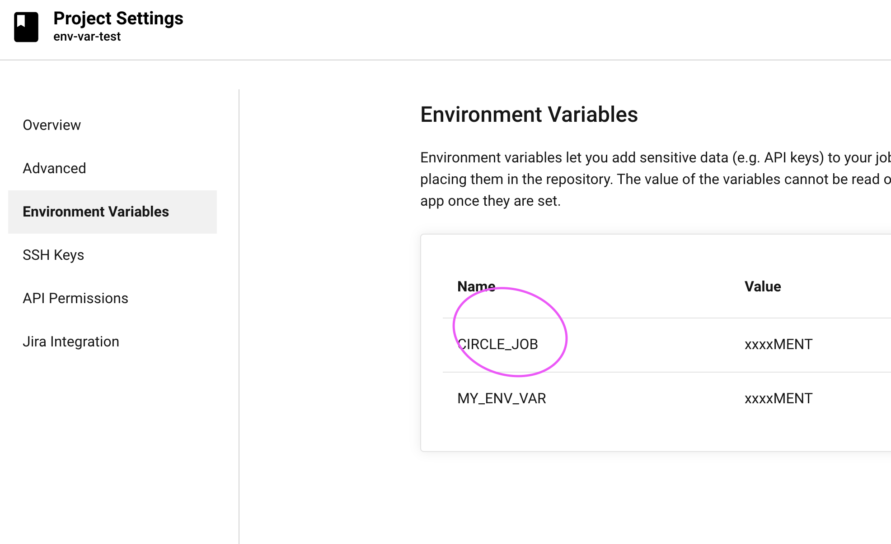
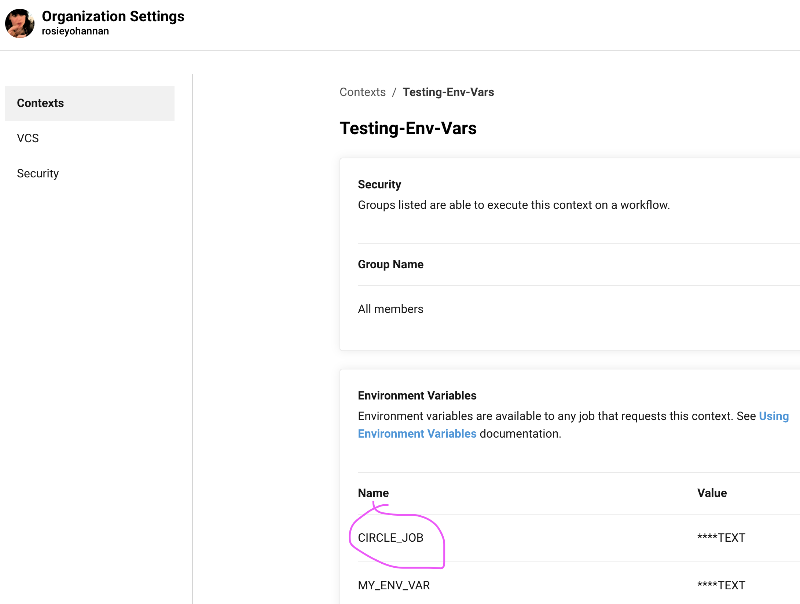

# Test env var order of precedence

In this repo there are branches showing the various ways to set an environment variable, and which take precedence over each other. For those that override CCI built-in env vars I've used CIRCLE_JOB.

You can see that the env vars is set in a context and in project settings too:

## 1. Set env var in shell command overrides everything, as follows:

* Environment variables declared with the `environment` key for a `run` step
* Environment variables set with the `environment` key for a job
* Built-in Environment Variables
* Context environment variables 
* Project-level environment variables
* Environment variables set with the `environment` key for a container

See https://app.circleci.com/jobs/github/rosieyohannan/env-var-test/96

On master branch

## 2. Set env var using `environment` key in a step overrides:
   
* Environment variables set with the `environment` key for a job
* Built-in Environment Variables
* Context environment variables 
* Project-level environment variables
* Environment variables set with the `environment` key for a container

See: https://app.circleci.com/pipelines/github/rosieyohannan/env-var-test/54/workflows/0272418a-a5d0-4ab6-be9a-00fa2c772a07/jobs/98

On branch: https://github.com/rosieyohannan/env-var-test/blob/env-key-run-step/.circleci/config.yml
    
## 3. Set env var using `environment` key at job level overrides:

* Built-in Environment Variables
* Context environment variables 
* Project-level environment variables
* Environment variables set with the `environment` key for a container

See: https://app.circleci.com/pipelines/github/rosieyohannan/env-var-test/57/workflows/2993776c-0275-48d7-bea6-dd276c86a28b/jobs/101

on branch: https://github.com/rosieyohannan/env-var-test/blob/job-env-key/.circleci/config.yml

## 4. Built-in env vars override:
   
* Context environment variables 
* Project-level environment variables
* Environment variables set with the `environment` key for a container

See: https://app.circleci.com/pipelines/github/rosieyohannan/env-var-test/59/workflows/821601bc-5167-401f-a636-7ca23a75888a/jobs/103

on branch: https://github.com/rosieyohannan/env-var-test/blob/built-in-env-var/.circleci/config.yml
    
## 5. Context env vars override:

* Project-level environment variables
* Environment variables set with the `environment` key for a container

See: https://app.circleci.com/jobs/github/rosieyohannan/env-var-test/105

on branch: https://github.com/rosieyohannan/env-var-test/blob/context-env-var/.circleci/config.yml
    
## 6. Env vars set in Project Settings override those set at the container level using the `environment` key.
    
see: https://app.circleci.com/pipelines/github/rosieyohannan/env-var-test/65/workflows/309a50db-94fd-4367-883f-e1e22e8a2683/jobs/109

On branch: https://github.com/rosieyohannan/env-var-test/blob/project-settings-override-container-var/.circleci/config.yml
