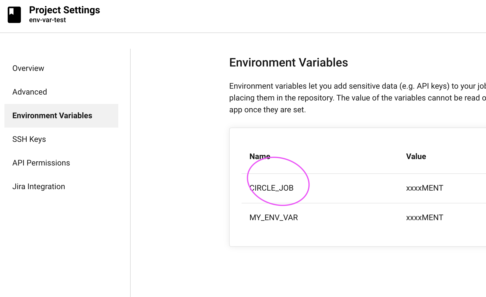
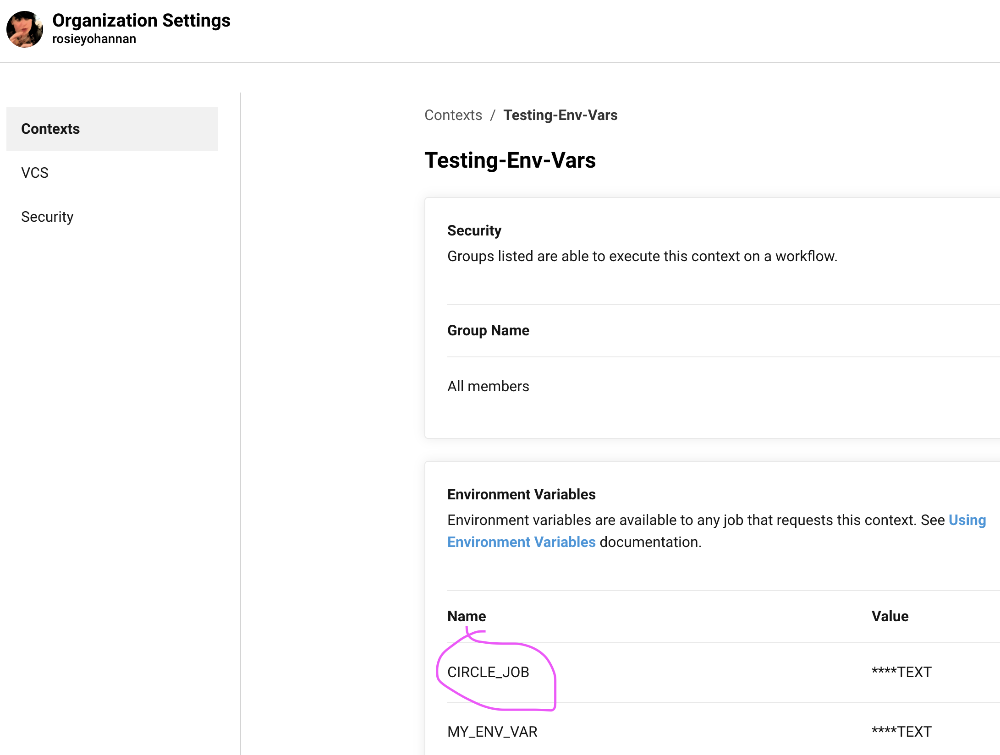

# Test env var order of precedence

1. Set env var in shell command overrides:

* Environment variables declared with the `environment` key for a `run` step
* Environment variables set with the `environment` key for a job
* Special CircleCI environment variables defined in the Built-in Environment Variables
* Context environment variables 
* Project-level environment variables
* Environment variables set with the `environment` key for a container

See https://app.circleci.com/jobs/github/rosieyohannan/env-var-test/74

On branch: https://github.com/rosieyohannan/env-var-test/tree/shell-cmd

